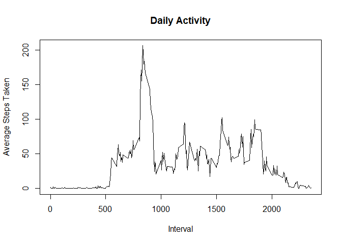
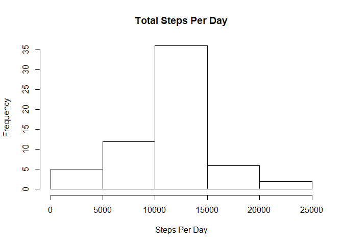
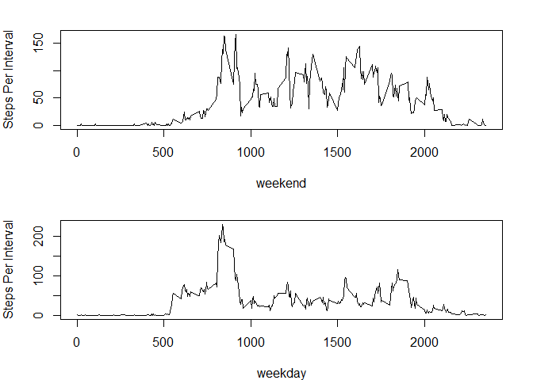

Reproducible Research Assignment 1
==================================

Let's load the data


```r
unzip("activity.zip")
stepdata<- read.csv("activity.csv", na.strings = "NA")
noNAs <- stepdata[complete.cases(stepdata),]
library(data.table)
noNAs2<-data.table(noNAs)
```

Let's answer question 1.
First, format the data:


```r
noNAs <- stepdata[complete.cases(stepdata),]
library(data.table)
noNAs2<-data.table(noNAs)
```

Then, calculate total steps per day and make a histogram  


```r
stepsPerDay<-noNAs2[, sum(steps), by = date]
hist(stepsPerDay$V1, main="Total Steps Per Day", xlab="Steps Per Day")
```

<!-- -->

Next, calculate and report the mean and the median per day  


```r
x<-c("mean", "median")
y<- c(mean(stepsPerDay$V1), median(stepsPerDay$V1))
data.frame(x,y)
```

```
##        x        y
## 1   mean 10766.19
## 2 median 10765.00
```

Now, on to question 2. 1st Make a time series of steps by interval averaged across all days.  


```r
stepsPerInterval<- noNAs2[,mean(steps), by=interval]
plot(stepsPerInterval$interval,stepsPerInterval$V1, type='l', main="Daily Activity", xlab="Interval", ylab="Average Steps Taken")
```

<!-- -->

Which interval contains the max amount of steps on average?  


```r
maxActivity<-stepsPerInterval[stepsPerInterval$V1==max(stepsPerInterval$V1)]
maxActivity$interval
```

```
## [1] 835
```

Next, question 3. Start with calculating and reporting the number of missing values.  


```r
incomplete<-stepdata[!complete.cases(stepdata),]
nrow(incomplete)
```

```
## [1] 2304
```

Next, fill in the missing values and create a new dataset - the average for the given interval will be used for each missing value.  


```r
stepdata2<-stepdata
i<-numeric()
for (i in 1:17568) {
  if (is.na(stepdata2$steps[i]==TRUE)) {
    z<-stepsPerInterval[stepsPerInterval$interval==stepdata2$interval[i]]$V1
    stepdata2$steps[i]<-z
  }
}
```

Let's make a histogram with the total number of steps per day:  


```r
stepdata3<-data.table(stepdata2)
stepsPerDay2<-stepdata3[, sum(steps), by = date]
hist(stepsPerDay2$V1, main="Total Steps Per Day", xlab="Steps Per Day")
```

<!-- -->

Next, calculate and report the mean and the median per day  


```r
x2<-c("mean", "median")
y2<- c(mean(stepsPerDay2$V1), median(stepsPerDay2$V1))
data.frame(x2,y2)
```

```
##       x2       y2
## 1   mean 10766.19
## 2 median 10766.19
```

As you can see, filling in missing data evened out the mean and the median.

Now, question 4: activity patterns on weekdays vs. weekends. First, let's convert the date column to a proper date format, and add another column that determines whether it is a weekday or a weekend.


```r
stepdata2$date<-as.Date(stepdata2$date)
wkdays <- c("Monday","Tuesday" , "Wednesday","Thursday", "Friday")
stepdata2$wday<-factor((weekdays(stepdata2$date) %in% wkdays), levels=c(FALSE, TRUE), labels=c("weekend","weekday"))
```

And now, let's create a panel plot with the weekday vs. weekend activity levels as a function of intervals.


```r
wkdaysteps<-data.table(stepdata2[stepdata2$wday=="weekday",])
spiwday<- wkdaysteps[,mean(steps), by=interval]
wkendsteps<-data.table(stepdata2[stepdata2$wday=="weekend",])
spiwend<- wkendsteps[,mean(steps), by=interval]
par(mfrow=c(2,1))
par(mar=c(4,4,2,2))
plot(spiwend$interval, spiwend$V1, type="l", xlab="weekend", ylab="Steps Per Interval")
plot(spiwday$interval, spiwday$V1, type="l", xlab="weekday", ylab="Steps Per Interval")
```

<!-- -->

As can be seen, people are generally more active later in the day on weekends.
